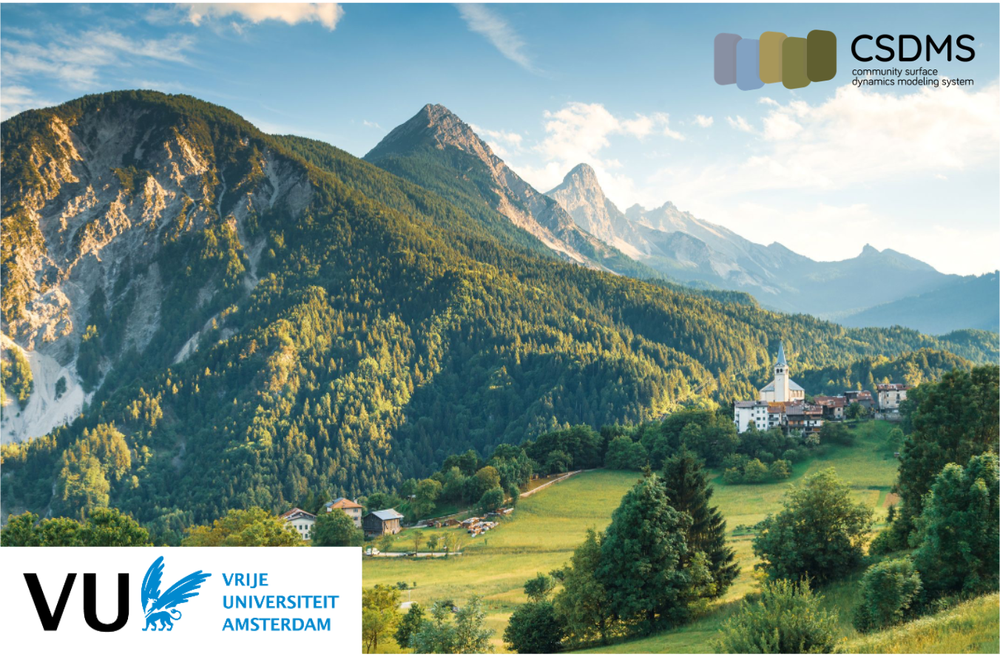

<!-- Links -->

[jhub]: https://csdms.colorado.edu/wiki/JupyterHub
[badge]: https://img.shields.io/badge/Run%20on-EarthscapeHub-orange
[jupyter]: ./lessons/jupyter/index.md
[shell]: ./lessons/shell/index.md
[hillslopes]: ./lessons/hillslopes/index.ipynb
[rivers]: ./lessons/rivers/index.ipynb
[landlab]: ./lessons/landlab/landlab/00_welcome.ipynb
[jhub-link]: https://lab.openearthscape.org/hub/user-redirect/git-pull?repo=https%3A%2F%2Fgithub.com%2Fcsdms%2Fivy&urlpath=lab%2Ftree%2Fivy%2FREADME.ipynb%3Fautodecode&branch=main
[jhub-info]: https://csdms.colorado.edu/wiki/JupyterHub
[swc]: http://software-carpentry.org
[swc-license]: https://github.com/swcarpentry/python-novice-inflammation/blob/gh-pages/LICENSE.md
[coco]: https://github.com/CodeToCommunicate
[coco-license]: https://github.com/CodeToCommunicate/CoCoLessons/blob/main/LICENSE
[comses]: https://comses.net
[comses-license]: https://github.com/comses-education/fair-osg-template/blob/main/LICENSE
[csdms-ivy]: https://github.com/csdms/ivy

# VU evolving landscapes

VU evolving landscapes is a collection of notebooks providing an introduction to landscape evolution modeling. 
Part of this material is based on the [CSDMS Ivy collection][csdms-ivy] that is written and maintained by the 
[Community Surface Dynamics Modeling System ](https://csdms.colorado.edu)(CSDMS).

## Lessons

1. [Project Jupyter][jupyter]
1. [Introduction to the Shell][shell]
1. [Rivers][rivers]
1. [Hillslopes][hillslopes]
1. [Landlab][landlab]

The lessons can be run locally
if a user installs Anaconda and a `git` client on their computer.
All lessons are also available to run
on [EarthscapeHub][jhub].
Click this button:

[![Run on EarthscapeHub][badge]][jhub-link]

to open the lessons directly on the EarthscapeHub *lab* instance!

> **Note:** The EarthscapeHub *lab* instance is password-protected.
  Please contact your instructor about obtaining a login,
  or visit [this][jhub-info] CSDMS wiki page for more information.

## Contributing

VU evolving landscapes  an open source project;
[contributions](./CONTRIBUTING.rst) that follow
the [contributor code of conduct](./CODE-OF-CONDUCT.rst) are welcomed
and are [acknowledged](./AUTHORS.rst).
All VU evolving landscapes  course material is
released under [CC BY 4.0 and MIT licenses](./LICENSE.md).
If you use the VU evolving landscapes course material,
please [cite](./CITATION.cff) it.

<!-- 

## Acknowledgments

CSDMS Ivy grew from a National Science Foundation Cybertraining pilot program,
*Cybertraining: Pilot: Collaborative Research:
Cybertraining for Earth Surface Processes Modelers*
(award numbers
[1924259](https://www.nsf.gov/awardsearch/showAward?AWD_ID=1924259) and
[1924185](https://www.nsf.gov/awardsearch/showAward?AWD_ID=1924185)).

Portions of the CSDMS Ivy Python lessons are derived
from material that is copyright
[Software Carpentry][swc]
and remixed under their [license][swc-license].
The Project Jupyter lesson
is taken from the [Code to Communicate][coco] project
and modified under their [license][coco-license].
Material in the FAIR software lesson is adapted,
under [license][comses-license],
from a [CoMSES Net][comses] project.

CSDMS Ivy is supported with funding from the National Science Foundation. -->
